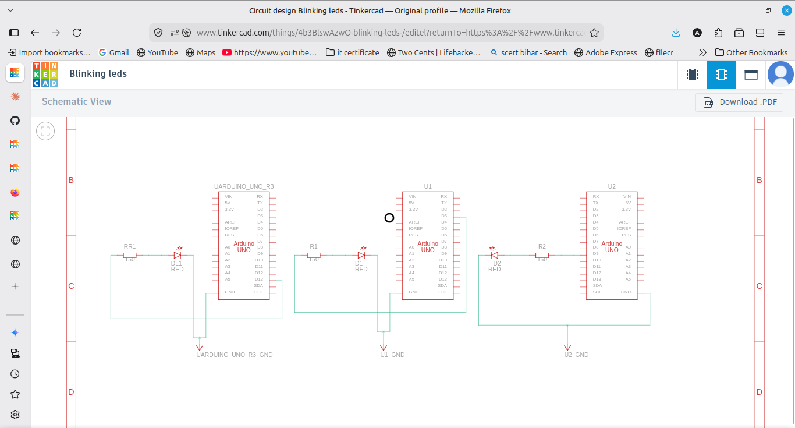
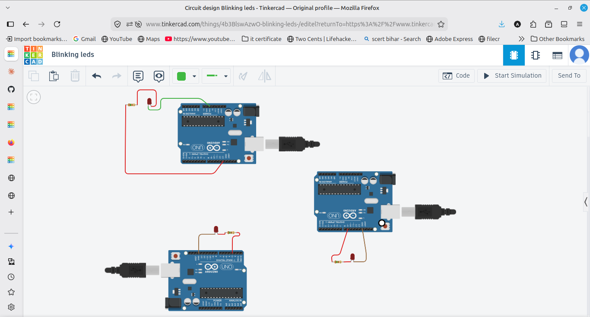

# LED Blink

Week 1 basic Arduino program. Blinks an LED on and off. I also added
two extra versions to try fading.

## Screenshots

## Components used for each
- Arduino UNO
- LED
- 220 ohm resistor
- Breadboard and jumper wires

## Circuit
LED connected to pin 13 through a 220 ohm resistor, other leg to GND.
The resistor is there so the LED doesn't get too much current.

## Files
- led_blink.ino - basic on/off blink
- blink_fade.ino - fades the LED using analogWrite
- blink_count.ino - increases brightness using a for loop

## How to run
Open the .ino file in Tinkercad or Arduino IDE, pick Arduino UNO as the
board, and start the simulation. The LED on pin 13 starts blinking.

## Output
LED stays on for 1 second, off for 1 second, and keeps repeating.

## Notes / issues I faced
- At first the fade didn't work because I used a normal pin. analogWrite
  only works on pins with ~ (like 3, 5, 6, 9, 10, 11).
