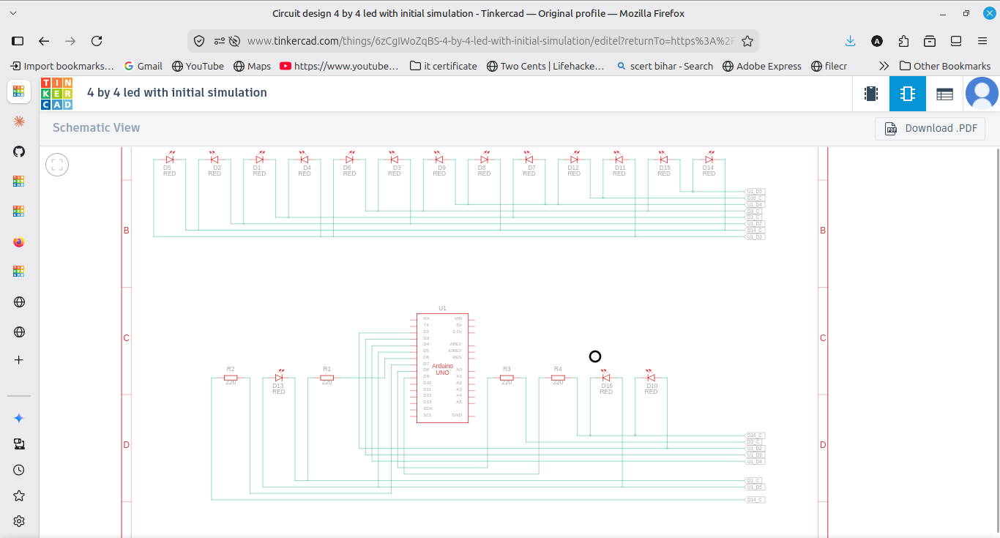

# 4x4 LED Matrix

Practical Q2. A 4x4 LED matrix that first lights each LED one by one,
then displays a letter (my initial).

## Components
- Arduino UNO
- 16 LEDs
- 4 resistors (220 ohm)
- Breadboard and jumper wires

## Wiring
It is a multiplexed matrix, so only 8 pins are used for 16 LEDs.
- Rows (anodes / long legs): pins 2, 3, 4, 5
- Columns (cathodes / short legs): pins 6, 7, 8, 9
- One resistor on each column line.

## How it works
The pins are stored in row and column arrays. The letter is a 4x4 grid of
1s and 0s (1 = on). At startup it sweeps through every LED one by one, then
the loop scans row by row to show the letter. Since columns are on the
cathode side, a column set LOW turns that LED ON.

## Output
Each LED blinks on in sequence, then the letter stays shown on the grid.

## Note
Because it is multiplexed, only one row is lit at a time and it scans fast,
so the letter can look a bit dim in the TinkerCAD simulation.
