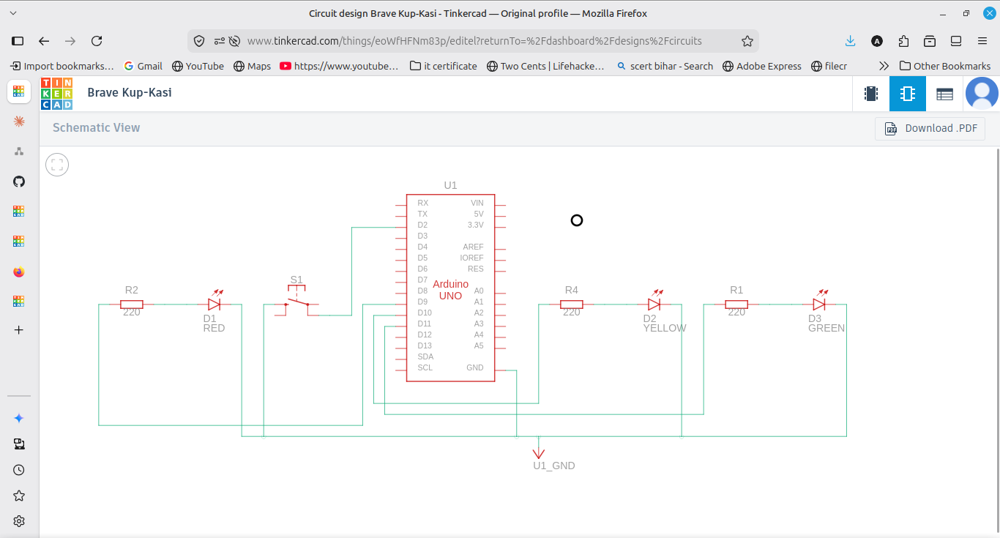
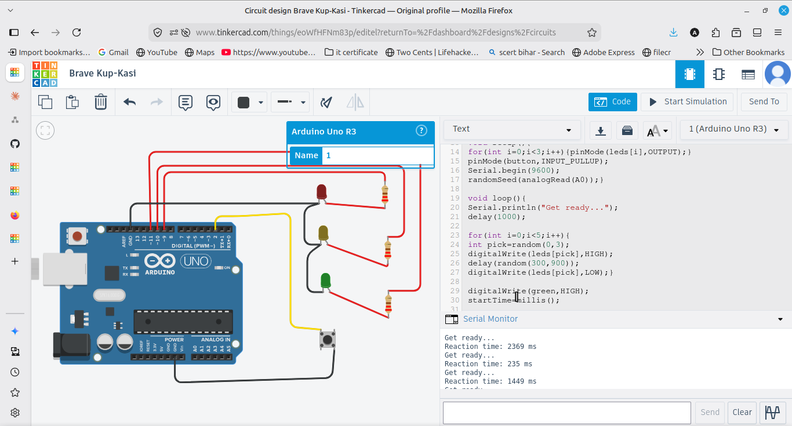

# Reaction Time Game

A reaction game with 3 LEDs and 1 push button. The LEDs blink in a random
order for random durations, then the green LED turns on as the signal. The
player presses the button as fast as possible, and the reaction time is
shown in milliseconds on the Serial Monitor.

## Components
- Arduino UNO
- 3 LEDs (one green) + 3 resistors (220 ohm)
- Push button
- Breadboard and jumper wires

## Wiring
- LEDs on pins 9, 10, 11 (green on 11), each through a 220 ohm resistor to GND
- Push button on pin 2 (diagonal legs), other side to GND (uses INPUT_PULLUP)

## How it works
The LEDs flash in a random order for a random wait, then the green LED
turns on and the time is recorded with millis(). When the button is pressed
(reads LOW with INPUT_PULLUP), the time difference gives the reaction time
in milliseconds.

## Output
Serial Monitor prints "Reaction time: X ms" after each button press.
