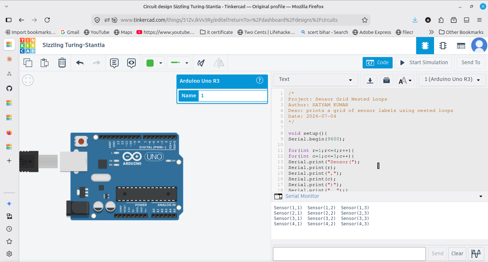

# Sensor Grid (Nested Loops)

Prints a grid of sensor labels Sensor(row,col) using nested for loops,
4 rows by 3 columns.

## How it works
An outer loop runs the rows (1 to 4) and an inner loop runs the columns
(1 to 3). Each Sensor(r,c) is printed on the same line, and println()
moves to the next line after each row to form the grid.

## Output
A 4x3 grid of Sensor(r,c) labels in the Serial Monitor.
