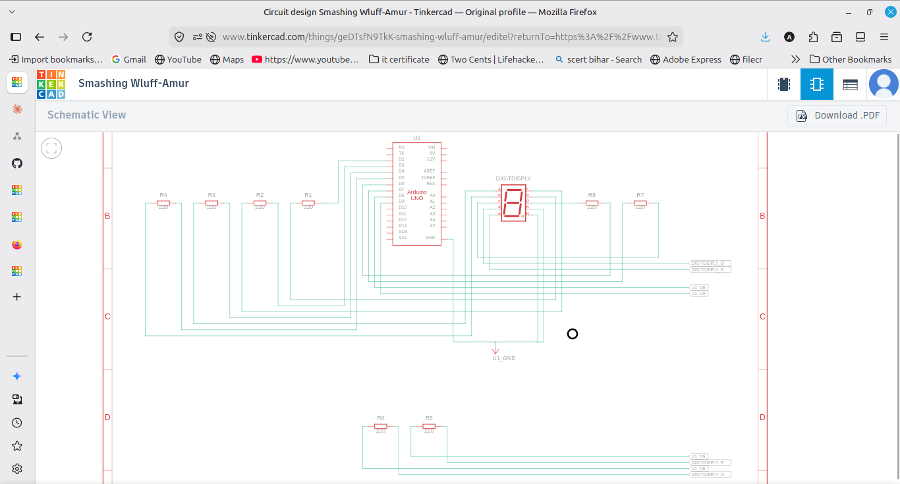

# Seven Segment Display

Displays digits 0 to 9 on a single common cathode seven segment display.

## Components
- Arduino UNO
- 7 segment display (common cathode)
- 7 resistors (220 ohm)
- Breadboard and jumper wires

## Wiring
Each segment connects to an Arduino pin through a 220 ohm resistor, and the
common pin goes to GND. My pin mapping is:
- a -> 4, b -> 5, c -> 7, d -> 8, e -> 9, f -> 3, g -> 2 (dp -> 6, not used)

## Research

**Creation:** A seven segment display is made of 7 LED bars arranged in a
figure 8, labelled a to g, plus a dot (dp). Lighting different combinations
of these segments forms the digits 0 to 9 and some letters.

**Interface:** Each segment is basically an LED, so it connects to a pin
through a resistor. Turning combinations of the a-g pins on/off shows a
number. To save pins, decoder ICs (like the 7447) or shift registers
