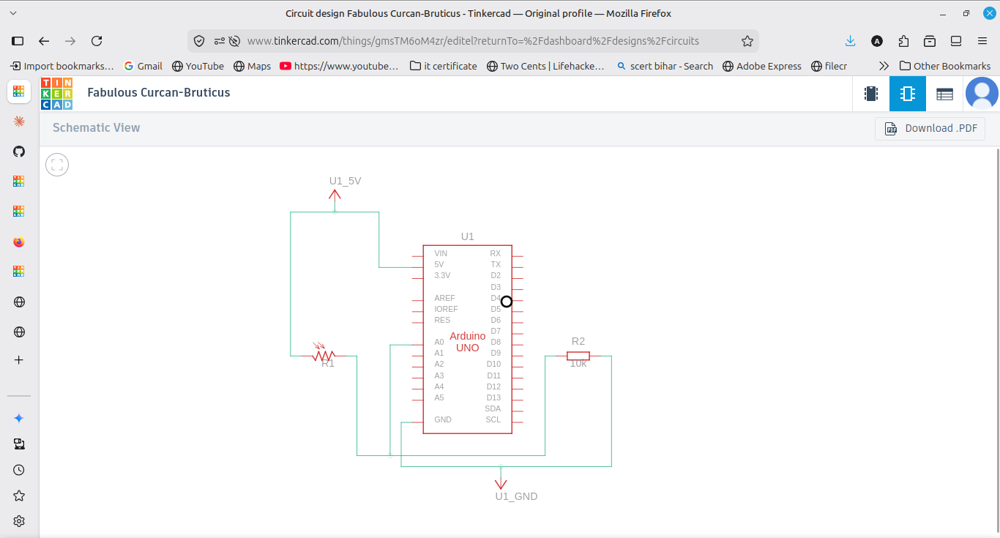
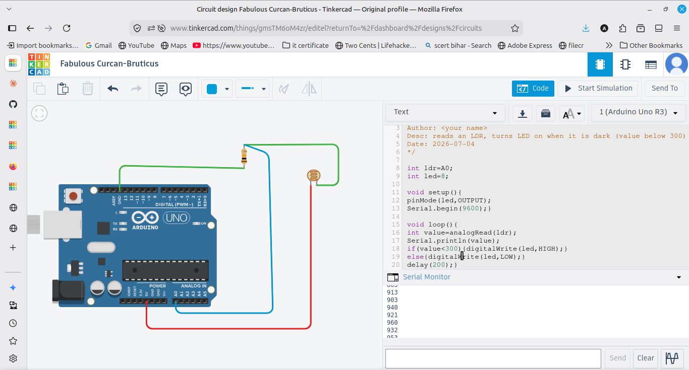

# Smart Street Light

Reads an LDR sensor and turns the LED ON when it is dark (value below 300),
otherwise keeps it OFF. Repeats continuously.

## Components
- Arduino UNO
- LDR (photoresistor)
- 10k ohm resistor (for the LDR)
- LED + 220 ohm resistor
- Breadboard and jumper wires

## Wiring
- LDR and 10k resistor in series: 5V -> LDR -> junction -> 10k -> GND
- A0 reads the middle junction (voltage divider)
- LED on pin 8 through a 220 ohm resistor to GND

## How it works
analogRead(A0) gives a light value from 0 to 1023. In the dark the value
drops. If it is below 300 the LED turns ON, else OFF. The value is printed
to the Serial Monitor so I could check the readings.

## Output
When I drag the light slider dark, the value falls below 300 and the LED
turns on. In bright light it turns off.

## Note
The threshold 300 was chosen by watching the Serial values in dark vs light
and picking a number in between.
