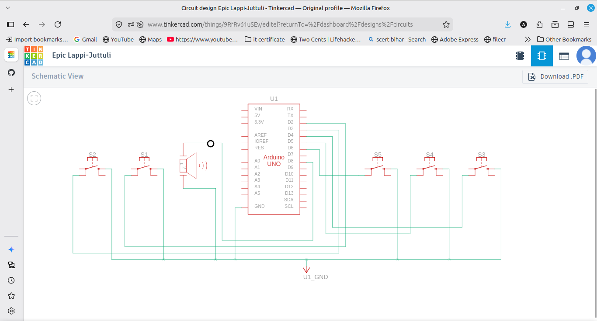
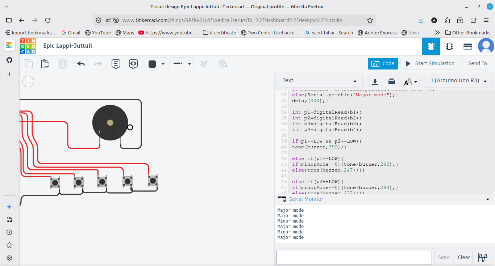

# Digital Piano

A 4 key musical instrument using push buttons and a passive buzzer. Each button plays a note (Do, Re, Mi, Fa). Pressing two buttons together plays Sol as a chord. A fifth button toggles between major and minor scale, which changes some of the note frequencies. Releasing all buttons silences the buzzer.

## Components
- Arduino UNO
- Passive buzzer
- 5 push buttons
- Breadboard and jumper wires

## Wiring
Buzzer positive to pin 8, negative to GND. Buttons on pins 2, 3, 4, 5 for the four notes and pin 6 for the mode toggle, all using INPUT_PULLUP with the other side to GND.

## Notes used
- Do 262 Hz, Re 294 Hz, Mi 330 Hz, Fa 349 Hz
- Two buttons together play Sol 392 Hz
- In minor mode some notes shift slightly lower

## How it works
The code reads each button and uses the tone() function to play the matching frequency on the buzzer. If two buttons are pressed together it plays the chord note. The fifth button flips a mode variable between major and minor, which changes some of the frequencies. When no button is pressed, noTone() turns the sound off.

## Output
Pressing a button plays its note, two together play a chord, releasing stops the sound, and the fifth button switches the scale (shown in the Serial Monitor).
