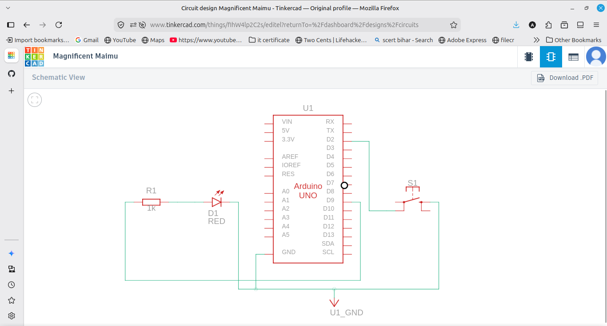
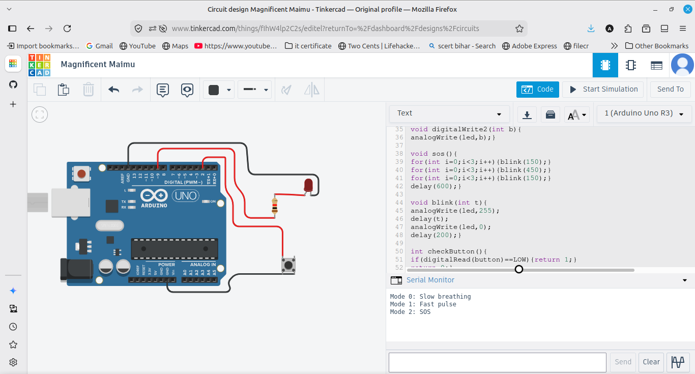

# PWM Night Light

A breathing LED night light with three modes that switch using a button. Mode 0 is slow breathing, mode 1 is a fast pulse, and mode 2 is an SOS pattern. The current mode is printed to the Serial Monitor.

## Components
- Arduino UNO
- LED and 220 ohm resistor
- Push button
- Breadboard and jumper wires

## Wiring
LED on pin 9 (a PWM pin) through a 220 ohm resistor to GND. Button on pin 2 using INPUT_PULLUP, with the other side to GND.

## How it works
The LED fades in and out using analogWrite (PWM) for the breathing effect. A button cycles through three modes, and the code runs a different pattern for each mode. The speed of the fade changes between slow and fast, and the SOS mode blinks the LED in the short-long-short pattern. The current mode is printed to Serial each time the button is pressed.

## Output
The LED breathes slowly at first. Pressing the button switches to fast pulse, then to SOS, then back to slow, and the mode name is printed each time.
