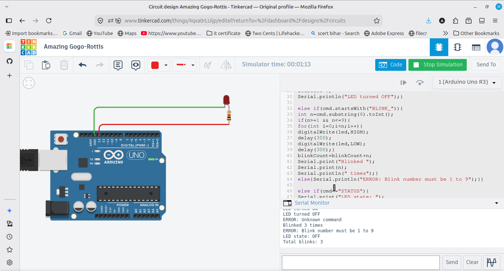

# Serial Command Interface

A program that reads typed commands from the Serial Monitor and controls the built-in LED. It supports LED_ON, LED_OFF, BLINK_X (blink X times, 1 to 9), STATUS and RESET. Any command it does not recognise prints an error message.

## Components
- Arduino UNO (uses the built-in LED on pin 13)

## Commands
- LED_ON turns the LED on
- LED_OFF turns the LED off
- BLINK_X blinks the LED X times (X from 1 to 9)
- STATUS prints the LED state and total blink count
- RESET sets the blink counter back to zero
- anything else prints ERROR: Unknown command

## How it works
The code waits for text from the Serial Monitor, reads the full line, and removes extra spaces. It then compares the text to each known command and does the matching action. For BLINK_X it reads the number after the underscore and checks it is between 1 and 9. If the command does not match anything, it prints an error, which is the input validation the task asked for.

## Output
Typing a valid command performs the action and prints a confirmation. Typing an unknown command prints ERROR: Unknown command.
