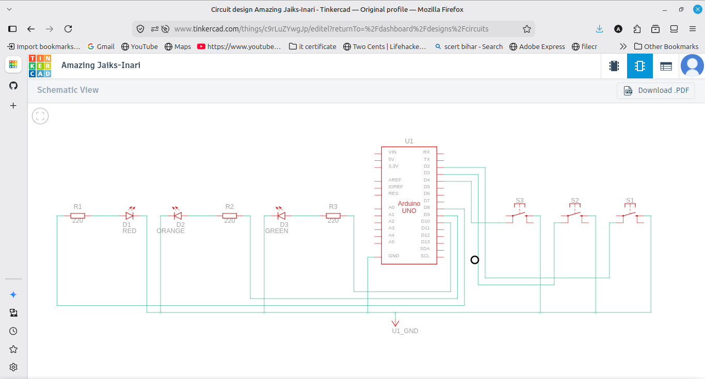
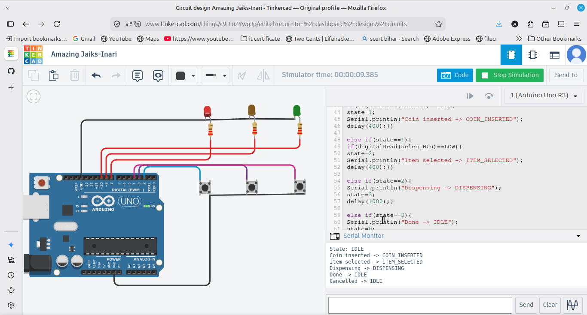

# Vending Machine State Machine

A simple vending machine built as a state machine with four states: IDLE, COIN_INSERTED, ITEM_SELECTED and DISPENSING. It uses three buttons (insert coin, select item, cancel) and three LEDs to show the current state. Every state change is printed to the Serial Monitor.

## Components
- Arduino UNO
- 3 LEDs and 3 resistors (220 ohm)
- 3 push buttons
- Breadboard and jumper wires

## Wiring
LEDs on pins 8, 9, 10 each through a 220 ohm resistor to GND. Buttons on pins 2, 3 and 4 using INPUT_PULLUP, with the other side to GND.

## How it works
A variable called state holds the current state as a number. The loop checks the buttons and changes the state when an event happens, for example inserting a coin moves it from IDLE to COIN_INSERTED. Each state lights a different LED and prints the transition to Serial. The cancel button returns the machine to IDLE from any state. This is the state machine idea, where the device is in one state at a time and moves between them on events.

## Output
The Serial Monitor prints each transition as the machine moves through idle, coin inserted, item selected and dispensing, and the LEDs show the current state.
