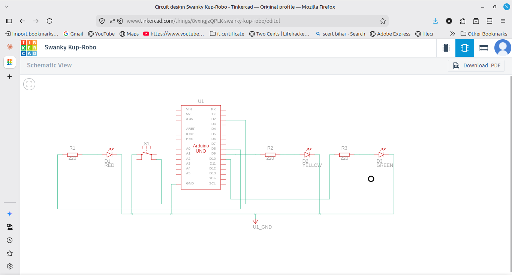
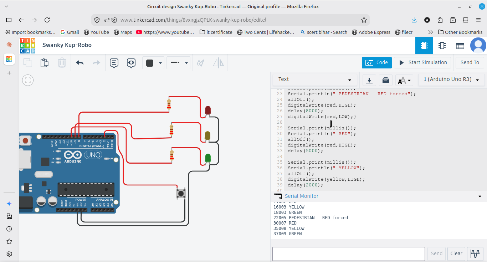

# Traffic Light Controller

A traffic light system using 3 LEDs (red, yellow, green) with a pedestrian button. Red stays on for 5 seconds, yellow for 2 seconds, and green for 4 seconds, then it repeats. When the pedestrian button is pressed, it forces red immediately and holds it for 8 seconds. The current state is printed to the Serial Monitor with a timestamp using millis().

## Components
- Arduino UNO
- 3 LEDs (red, yellow, green) and 3 resistors (220 ohm)
- Push button
- Breadboard and jumper wires

## Wiring
Red on pin 8, yellow on pin 9, green on pin 10, each through a 220 ohm resistor to GND. The pedestrian button is on pin 2 using INPUT_PULLUP, with the other side to GND.

## How it works
The loop cycles through red, yellow and green with fixed delays and prints each state with a timestamp. At the start of each cycle it checks the button, and if it is pressed it forces red on for 8 seconds before continuing.

## Output
The LEDs cycle red, yellow, green on repeat, and the Serial Monitor prints each state with the time. Pressing the button forces red and prints a pedestrian message.
