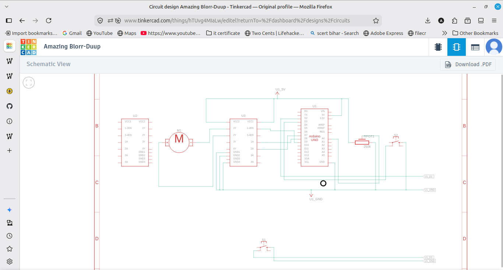
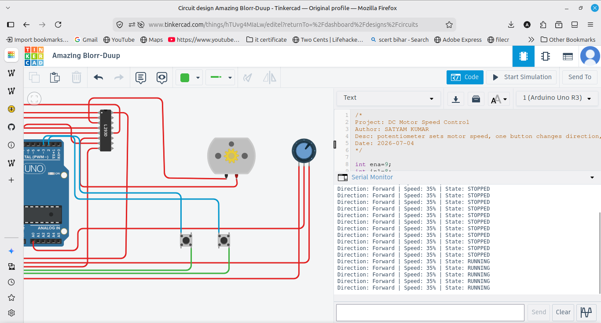

# DC Motor Speed Control (L293D)

Controls a DC motor through an L293D motor driver on an Arduino UNO. A potentiometer sets the motor speed, one button changes the direction (forward/reverse), and another button starts or stops the motor. The direction, speed percentage and state are shown on the Serial Monitor.

## Components
- Arduino UNO
- L293D motor driver
- DC motor
- Potentiometer
- 2 push buttons
- Breadboard and jumper wires

## Wiring
L293D Enable 1 to pin 9 (PWM speed), Input 1 to pin 8, Input 2 to pin 7. Both Power terminals to 5V, grounds to GND. Output 1 and Output 2 go to the two motor terminals. Potentiometer middle to A0, outer pins to 5V and GND. Direction button on pin 2, start/stop button on pin 3, both using INPUT_PULLUP.

## How it works
The potentiometer value is mapped to a PWM speed (0 to 255) sent to the enable pin, which sets the motor speed. The two input pins set the direction by flipping which one is HIGH. One button toggles direction and another toggles running or stopped. All values are printed to Serial.

## Output
Turning the potentiometer changes the motor speed, one button reverses direction, and another stops or starts it, with the status printed to the Serial Monitor.
