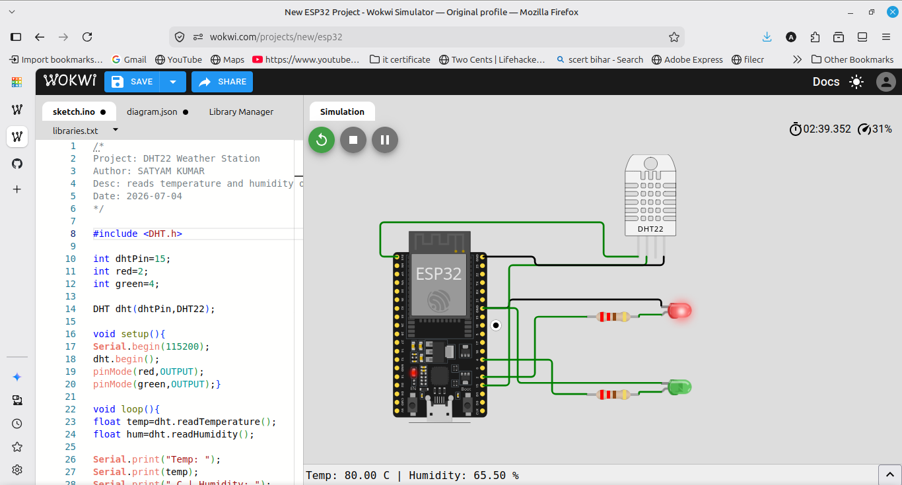
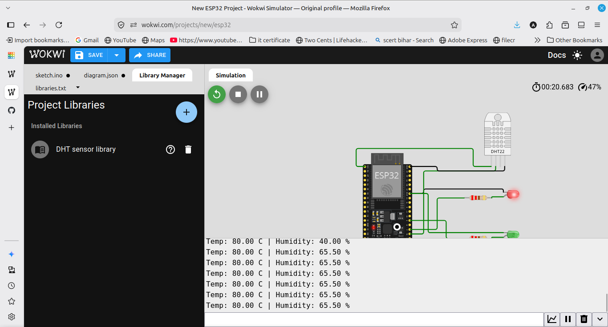

# DHT22 Weather Station

An ESP32 weather station that reads temperature and humidity using a DHT22 sensor. It prints the readings to the Serial Monitor every 2 seconds. If the temperature goes above 35 C or humidity above 80 percent, a red LED turns on as a warning, otherwise a green LED stays on for normal conditions. Built and simulated in Wokwi because the DHT sensor and ESP32 are not available in TinkerCAD.

## Components
- ESP32
- DHT22 temperature and humidity sensor
- Red LED and Green LED with 220 ohm resistors
- Jumper wires

## Wiring
DHT22 VCC to 3V3, GND to GND, data pin to GPIO 15. Red LED on GPIO 2 and green LED on GPIO 4, each through a 220 ohm resistor to GND. The ESP32 runs at 3.3V, so the sensor is powered from 3V3 not 5V.

## How it works
The DHT library reads the temperature and humidity from the sensor. The values are printed to Serial, and simple if conditions turn on the red LED when it is too hot or humid, or the green LED when conditions are normal.

## Output
The Serial Monitor prints temperature and humidity every 2 seconds, and the LEDs show whether conditions are normal or a warning.
