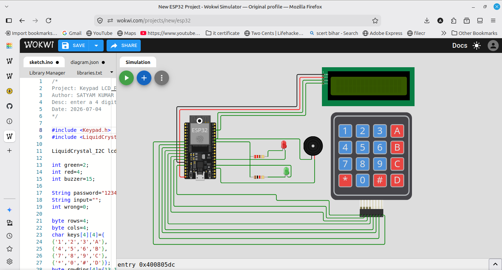
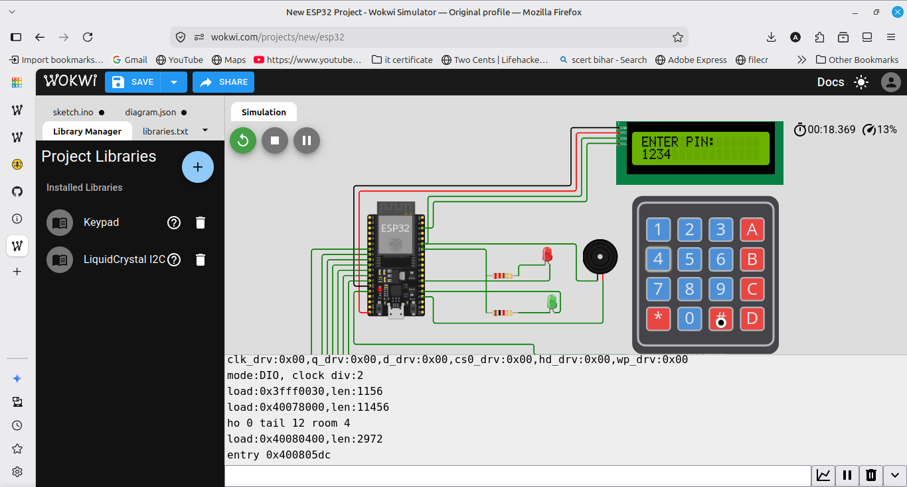

# Keypad LCD Password System

A password-protected access system using a 4x4 keypad and a 16x2 I2C LCD on an ESP32. The user enters a 4-digit PIN and presses #. A correct PIN shows ACCESS GRANTED with a green LED, a wrong PIN shows ACCESS DENIED with a red LED and buzzer, and after 3 wrong attempts the system locks for 10 seconds.

## Components
- ESP32
- 4x4 membrane keypad
- 16x2 I2C LCD
- Green LED and Red LED with 220 ohm resistors
- Buzzer
- Jumper wires

## Wiring
LCD via I2C: SDA to GPIO 21, SCL to GPIO 22, VCC and GND. Keypad rows on GPIO 13, 12, 14, 27 and columns on GPIO 26, 25, 33, 32. Green LED on GPIO 2, red LED on GPIO 4, buzzer on GPIO 15.

## How it works
The Keypad library reads which key is pressed and builds up the entered PIN. When # is pressed, the code compares it to the stored password. If it matches, the LCD shows ACCESS GRANTED and lights the green LED. If wrong, it shows ACCESS DENIED with the red LED and buzzer, and counts the attempt. After 3 wrong attempts it locks for 10 seconds.

## Output
The LCD shows ENTER PIN, then ACCESS GRANTED or ACCESS DENIED based on the entered PIN, with the matching LED and buzzer response.
