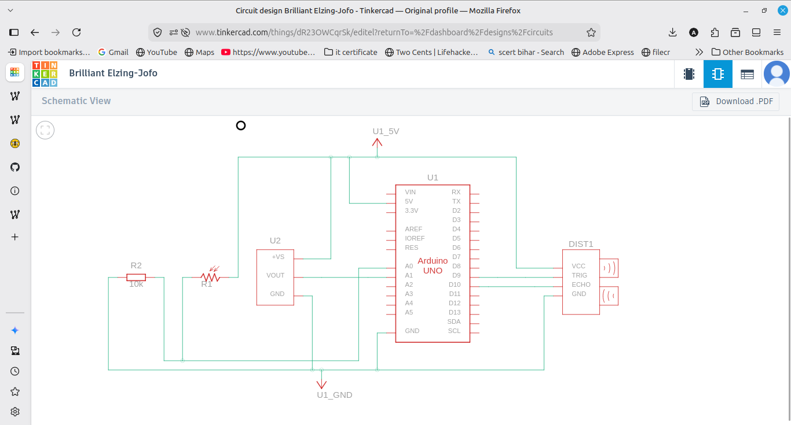
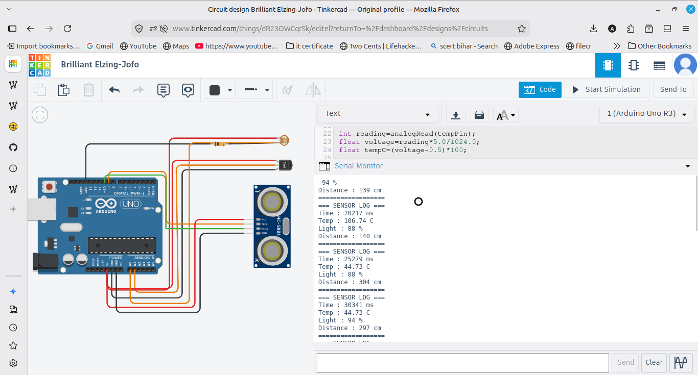

# Multi Sensor Data Logger

Reads three sensors at once on an Arduino UNO and prints a formatted log every 5 seconds. It logs temperature, light level and distance together in a clean block.

## Components
- Arduino UNO
- LDR with 10k ohm resistor
- TMP36 temperature sensor
- HC-SR04 ultrasonic sensor
- Breadboard and jumper wires

## Wiring
LDR voltage divider read by A0. TMP36 middle leg to A1. Ultrasonic Trig to pin 9, Echo to pin 10, VCC to 5V, GND to GND.

## How it works
The code reads the LDR (converted to a percentage), the TMP36 (converted to Celsius), and the ultrasonic distance (using the echo time and distance formula). Every 5 seconds it prints all three in a formatted log block with a timestamp from millis().

## Note
The assignment used a DHT sensor, but TinkerCAD does not have one, so I used the TMP36 temperature sensor for the temperature reading.

## Output
Every 5 seconds the Serial Monitor prints a log block with time, temperature, light percentage and distance. 20 lines of captured output are saved in sensor_log.txt.
