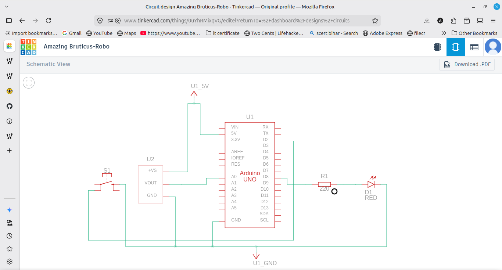
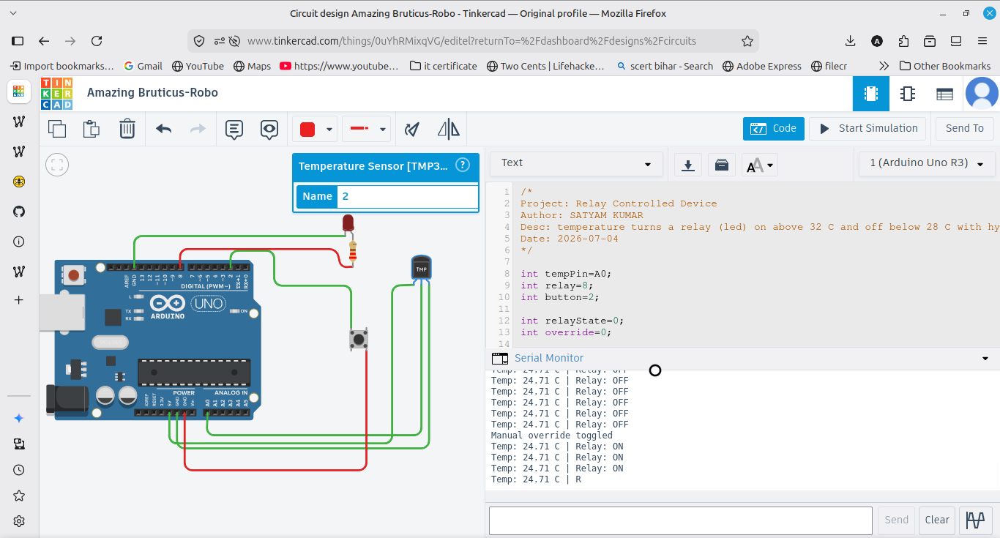

# Relay Controlled Device

Simulates a relay controlling an AC appliance using an Arduino UNO, with an LED standing in for the relay. A temperature sensor triggers the relay ON when the temperature goes above 32 C and OFF when it drops below 28 C, using hysteresis so it does not rapidly switch. A button acts as a manual override.

## Components
- Arduino UNO
- TMP36 temperature sensor
- LED with 220 ohm resistor (as the relay/appliance)
- Push button
- Breadboard and jumper wires

## Wiring
TMP36 middle leg to A0, outer legs to 5V and GND. LED (relay) on pin 8 through a 220 ohm resistor to GND. Override button on pin 2 using INPUT_PULLUP.

## How it works
The temperature is read from the sensor and converted to Celsius. If it goes above 32 C the relay turns on, and it only turns off once it drops below 28 C. This gap between the on and off points is hysteresis, which stops the relay from flickering near the threshold. The button toggles a manual override that forces the relay on.

## Note
The assignment used a DHT sensor, but TinkerCAD does not have one, so I used the TMP36 temperature sensor which works the same way for triggering the relay.
