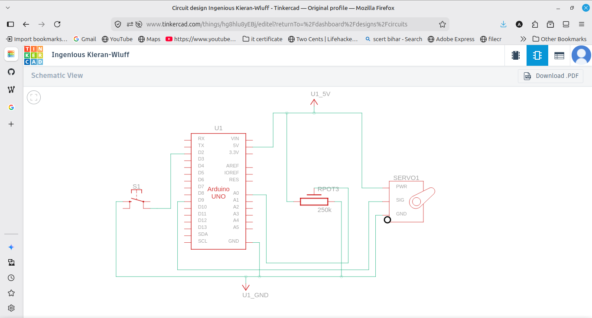
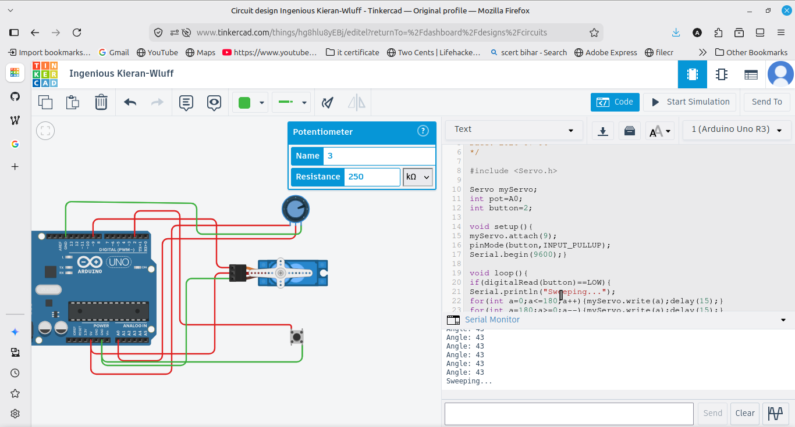

# Servo Motor Control

Controls a micro servo (SG90) with a potentiometer. Turning the potentiometer moves the servo between 0 and 180 degrees, and the angle is shown on the Serial Monitor. A button makes the servo do one full sweep from 0 to 180 and back.

## Components
- Arduino UNO
- Micro servo (SG90)
- Potentiometer
- Push button
- Breadboard and jumper wires

## Wiring
Servo signal wire to pin 9, servo positive to 5V, servo negative to GND. Potentiometer middle pin to A0 with the outer pins to 5V and GND. Button on pin 2 using INPUT_PULLUP with the other side to GND.

## How it works
The potentiometer gives a value from 0 to 1023 using analogRead. This is converted to an angle from 0 to 180 with the map function, and the servo is moved to that angle using the Servo library. When the button is pressed, the servo runs one full sweep from 0 to 180 degrees and back.

## Output
Turning the potentiometer moves the servo and prints the angle on the Serial Monitor. Pressing the button does one full sweep.
