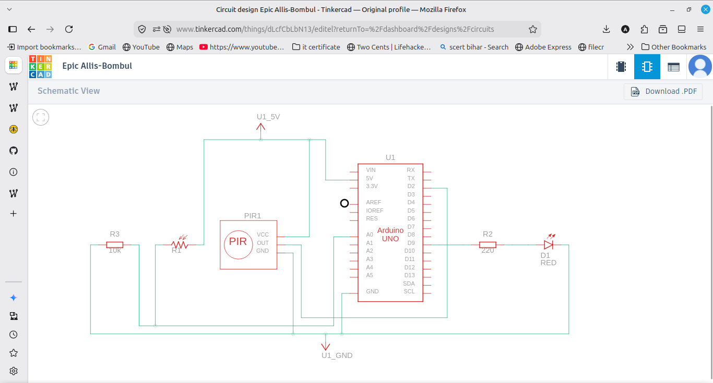
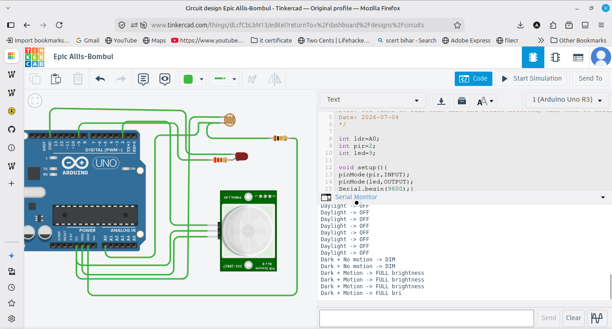

# Smart Street Light

An intelligent street light using an LDR and a PIR motion sensor on an Arduino UNO. When it is dark and motion is detected, the LED turns on at full brightness. When it is dark but there is no motion, the LED dims to save power. In daylight the LED stays off.

## Components
- Arduino UNO
- LDR (photoresistor) with 10k ohm resistor
- PIR motion sensor
- LED with 220 ohm resistor
- Breadboard and jumper wires

## Wiring
LDR in a voltage divider: 5V to LDR, LDR to a junction, junction through a 10k resistor to GND, and the junction read by A0. PIR OUT to pin 2, VCC to 5V, GND to GND. LED on pin 9 (a PWM pin) through a 220 ohm resistor to GND.

## How it works
analogRead reads the LDR to check if it is dark (value below 300). digitalRead checks the PIR for motion. If it is dark and there is motion, the LED goes to full brightness using analogWrite. If it is dark with no motion, the LED dims. In daylight the LED is turned off. This saves power by only lighting fully when needed.

## Output
The Serial Monitor prints the current state (full brightness, dim, or off) based on the light level and motion.
