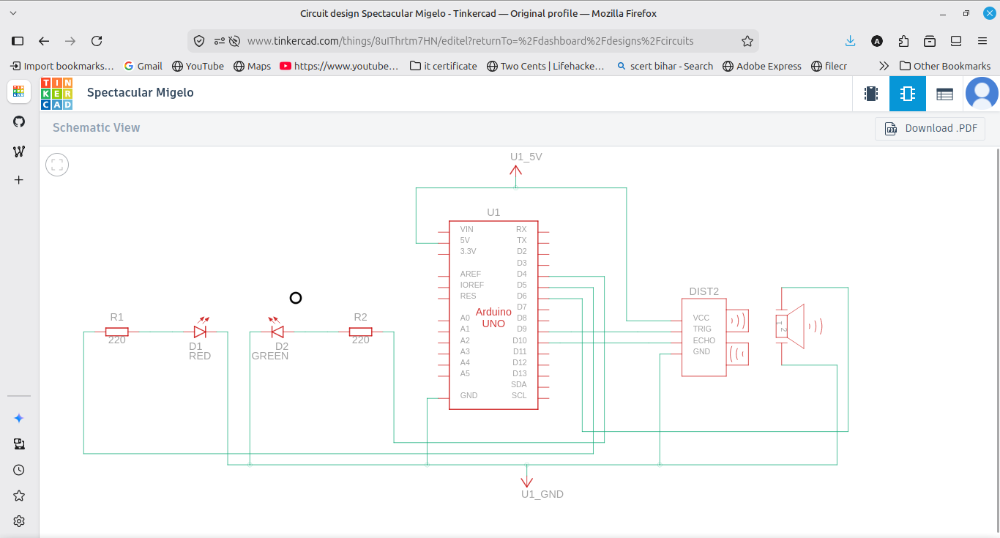
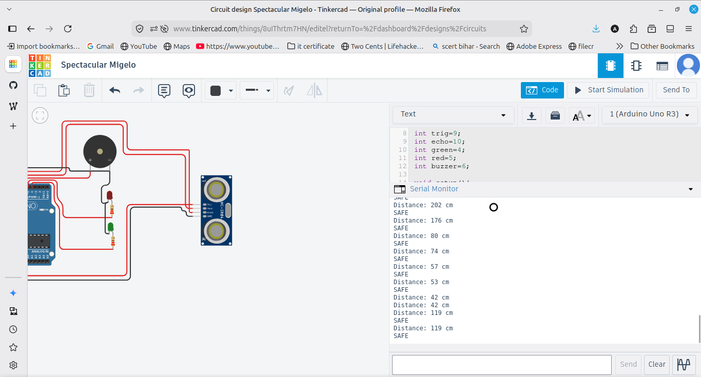

# Ultrasonic Parking Sensor

A parking distance sensor using an HC-SR04 ultrasonic sensor. It measures the distance to an object and gives warnings with LEDs and a buzzer as the object gets closer, like a car parking sensor.

## Components
- Arduino UNO
- HC-SR04 ultrasonic sensor
- Green LED and Red LED with 220 ohm resistors
- Buzzer
- Breadboard and jumper wires

## Wiring
Sensor VCC to 5V, GND to GND, Trig to pin 9, Echo to pin 10. Green LED on pin 4, Red LED on pin 5, buzzer on pin 6.

## How it works
The sensor sends an ultrasonic pulse and measures how long the echo takes to return using pulseIn. The time is converted to distance in cm with the formula distance = (duration * 0.034) / 2. Based on the distance it warns in stages: over 50 cm is safe, 20 to 50 cm turns on green with slow beeps, 10 to 20 cm turns on red with faster beeps, and under 10 cm is a continuous alert.

## Output
The Serial Monitor prints the distance and the status, and the LEDs and buzzer change as the object gets closer.

## Note
At first the distance always read 0 because I connected the sensor VCC to VIN instead of 5V. Moving it to the 5V pin fixed it.
