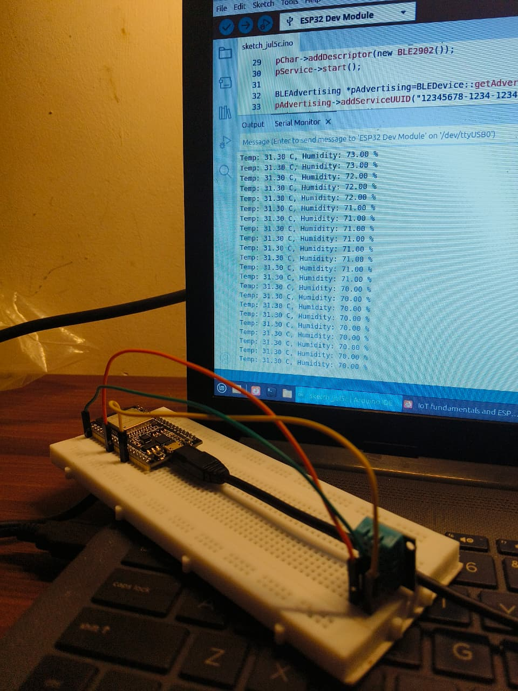
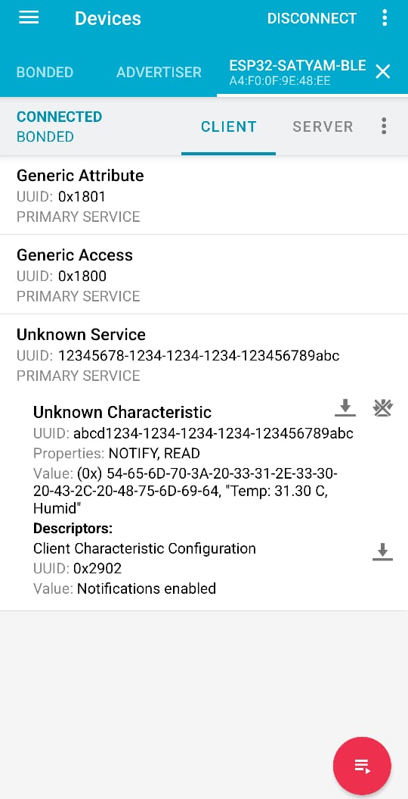

# BLE Sensor Dashboard

An ESP32 that reads a DHT11 sensor and broadcasts the temperature and humidity over BLE (Bluetooth Low Energy). A phone app (nRF Connect) scans for the device and reads the live values.

## Components
- ESP32
- DHT11 temperature and humidity sensor
- Breadboard and jumper wires

## Wiring
DHT11 VCC to 3V3, GND to GND, data pin to GPIO 25.

## How it works
The ESP32 sets up a BLE server with a service and a characteristic. It reads the DHT11 every 3 seconds and updates the characteristic value with the temperature and humidity, then notifies connected devices. A phone running nRF Connect scans for ESP32-SATYAM-BLE, connects, and reads the value.

## Note
BLE works on both Android and iPhone, unlike classic Bluetooth. The ESP32 has BLE built in, so no extra module was needed. Tested on real hardware.
