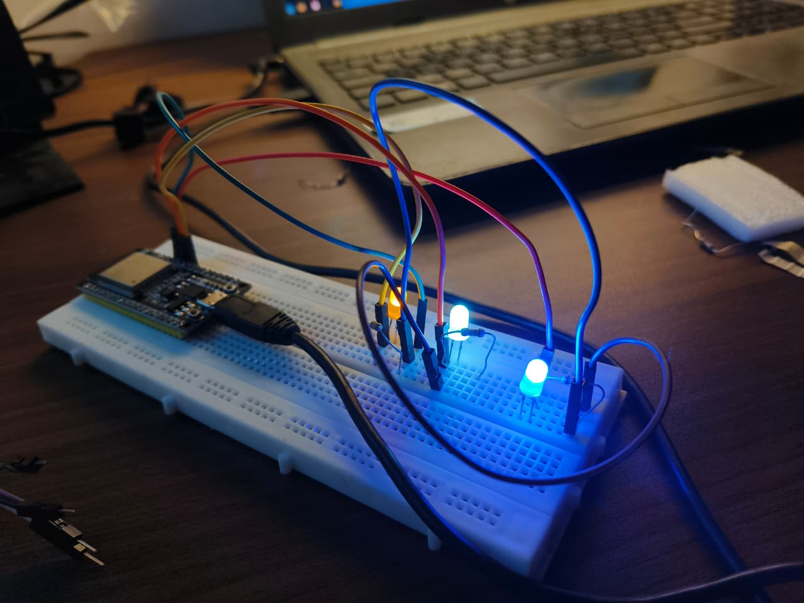
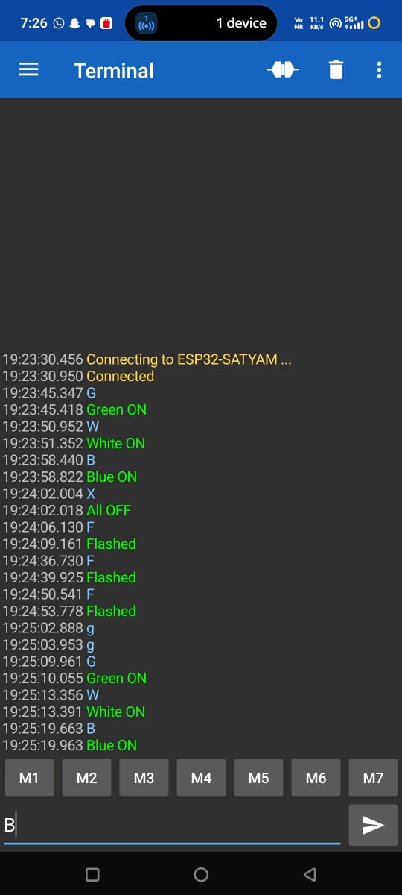

# Bluetooth LED Controller

An ESP32 that uses its built-in Bluetooth to control 3 LEDs from a phone. Letters sent from a Bluetooth terminal app turn the LEDs on or off and flash them.

## Components
- ESP32
- 3 LEDs (green, white, blue) with resistors
- Breadboard and jumper wires

## Wiring
Green LED on GPIO 18, white on GPIO 19, blue on GPIO 21, each through a resistor to GND.

## Commands (sent from phone)
- G turns the green LED on
- W turns the white LED on
- B turns the blue LED on
- X turns all LEDs off
- F flashes all LEDs 5 times

## How it works
The ESP32 starts a Bluetooth serial connection named ESP32-SATYAM. A phone pairs with it and sends single letters using the Serial Bluetooth Terminal app. The code reads each letter and controls the matching LED, and sends a reply back to the phone.

## Note
The ESP32 has built-in Bluetooth, so it was used directly instead of a separate HC-05 module. The LEDs available were green, white and blue, so the commands were mapped to G, W and B. Tested on real hardware with an Android phone.
