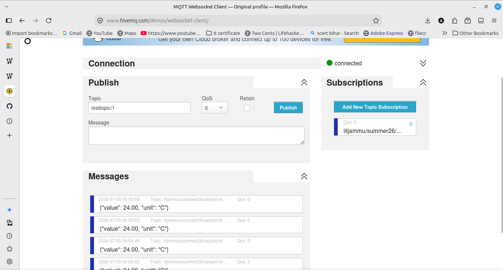
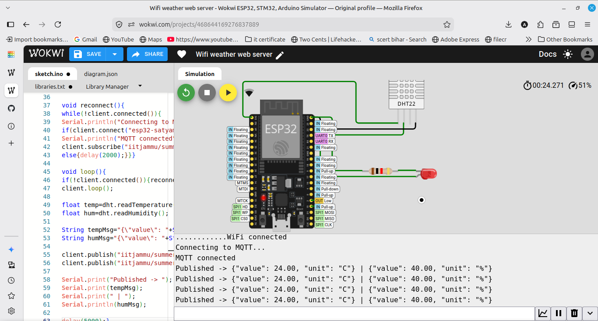

# MQTT Sensor Publisher

An ESP32 that connects to WiFi and publishes temperature and humidity readings to a public MQTT broker (broker.hivemq.com) every 5 seconds in JSON format. It also subscribes to a control topic so an on or off message toggles the LED.

## Components
- ESP32
- DHT22 sensor
- LED with 220 ohm resistor
- Jumper wires

## Topics
- iitjammu/summer26/satyam/temperature
- iitjammu/summer26/satyam/humidity
- iitjammu/summer26/satyam/led_control (subscribe, toggles LED with on/off)

## How it works
The ESP32 joins WiFi and connects to the MQTT broker using the PubSubClient library. Every 5 seconds it publishes temperature and humidity as JSON to their topics. It also subscribes to a control topic, and when it receives on or off it switches the LED. Messages were verified using the HiveMQ web client.

## Output
The Serial Monitor shows the published JSON, and the HiveMQ web client shows the messages arriving on the topics.
