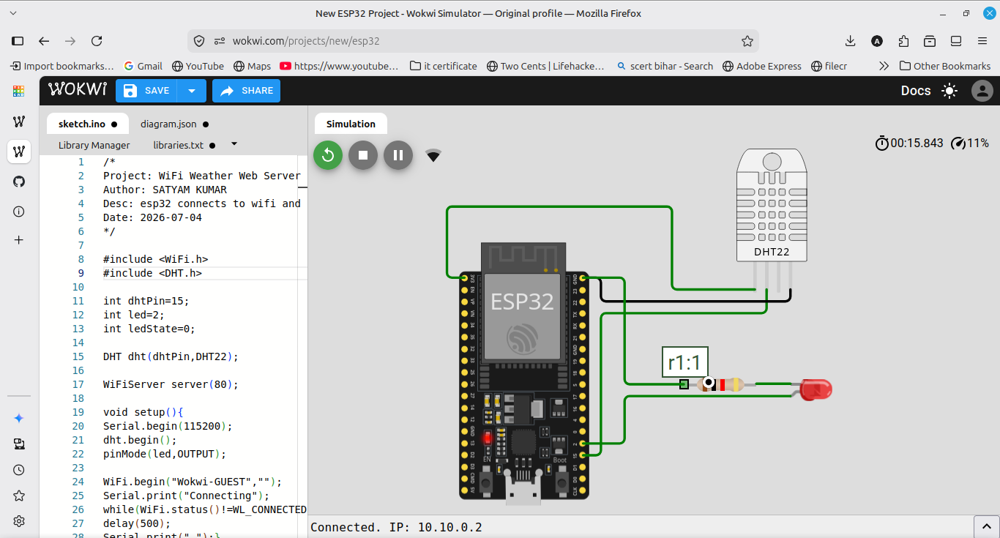
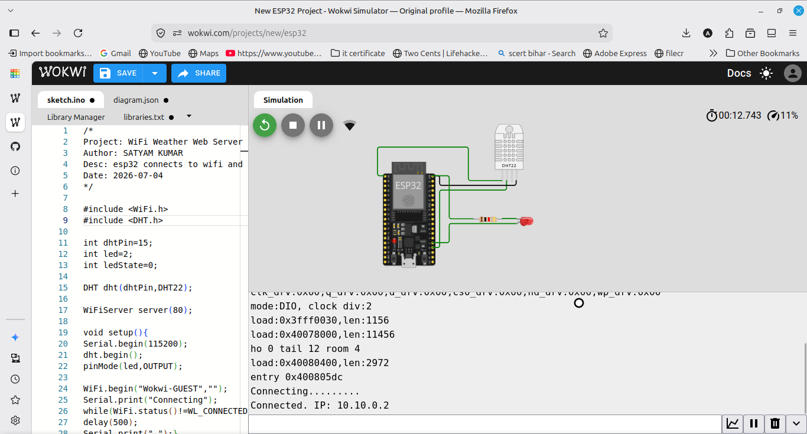

# WiFi Weather Web Server

An ESP32 that connects to WiFi and runs a web server showing temperature, humidity and uptime on a web page that auto-refreshes every 10 seconds, with a button to toggle an LED. Built in Wokwi using its virtual WiFi network (Wokwi-GUEST).

## Components
- ESP32
- DHT22 sensor
- LED with 220 ohm resistor
- Jumper wires

## Wiring
DHT22 data to GPIO 15, VCC to 3V3, GND to GND. LED on GPIO 2 through a 220 ohm resistor to GND.

## How it works
The ESP32 joins the WiFi network and starts a web server on port 80. When a browser connects, it reads the sensor and sends back an HTML page with temperature, humidity and uptime. The page auto-refreshes every 10 seconds, and a link toggles the LED. The Serial Monitor shows the connection and the assigned IP address.

## Note
Wokwi uses a simulated WiFi network, so the served page is viewable only inside the simulation. The Serial output confirms the server connects and runs. This can also be tested on real ESP32 hardware by opening the IP in a phone browser.
